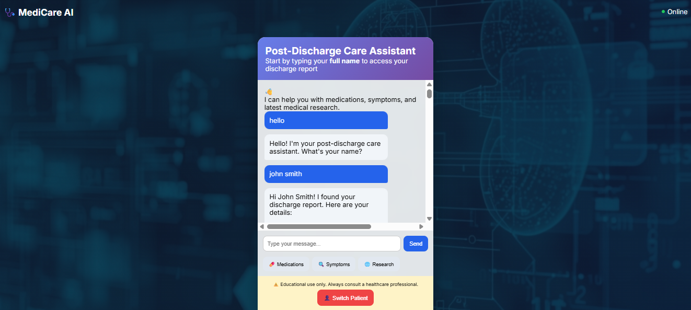
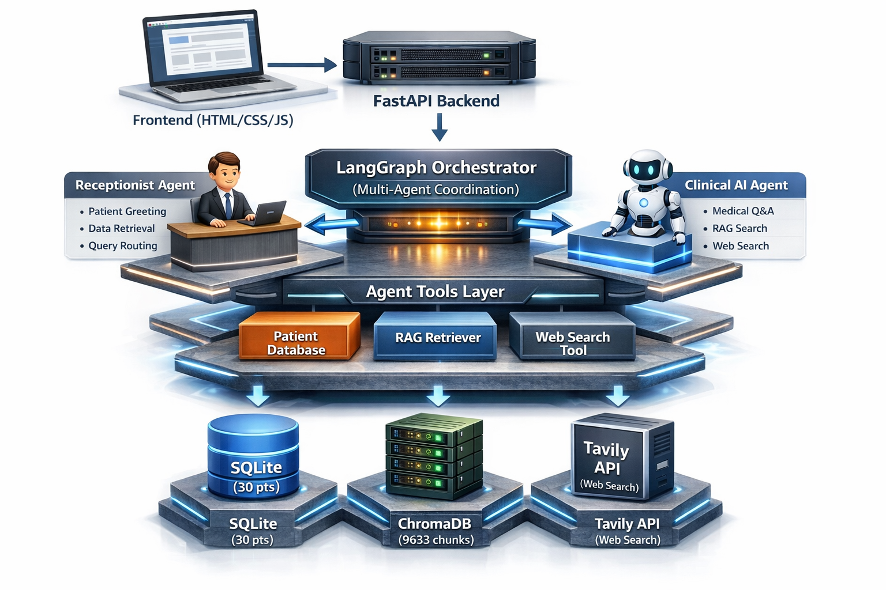

# **🏥 Post-Discharge Medical AI Assistant**


> **A production-ready multi-agent medical AI system for post-discharge patient care using FastAPI, LangGraph, RAG, and Web Search**


The **Post-Discharge Medical AI Assistant** is a sophisticated multi-agent conversational AI system designed to support patients during their post-discharge recovery period. Built with state-of-the-art technologies including LangGraph for agent orchestration and Groq's lightning-fast LLM inference, this system demonstrates how AI can enhance patient care through intelligent information retrieval and personalized medical guidance.

[](https://www.python.org/)
[](https://fastapi.tiangolo.com/)
[](https://github.com/langchain-ai/langgraph)
[](https://groq.com/)
[](https://www.trychroma.com/)
[](https://www.sqlite.org/)
[](https://tavily.com/)
[](https://developer.mozilla.org/en-US/docs/Web/HTML)
[](https://developer.mozilla.org/en-US/docs/Web/CSS)
[](https://developer.mozilla.org/en-US/docs/Web/JavaScript)
[](https://www.docker.com/)
[](https://www.apache.org/licenses/LICENSE-2.0)


##  Application Demo (Real-Time Inference)




##  Overview

This **Proof of Concept (POC)** system demonstrates a multi-agent AI architecture for post-discharge patient care in nephrology. It combines:

- **RAG (Retrieval Augmented Generation)** with a comprehensive nephrology textbook
- **Multi-Agent Orchestration** using LangGraph
- **Real-time Web Search** for latest medical research
- **Patient Data Management** with SQLite
- **Comprehensive Logging** of all interactions
- **FastAPI backend + modern web frontend**
- **Docker & Hugging Face deployment readiness**

⚠️ Educational & Demonstration Purpose Only
This system does NOT replace professional medical advice.


##  Features

###  **Multi-Agent Architecture**

1. **Receptionist Agent**
   - Greets patients warmly
   - Retrieves discharge reports from database
   - Asks follow-up questions based on patient history
   - Routes medical queries to Clinical Agent

2. **Clinical AI Agent**
   - Answers medical questions using RAG
   - Searches 9633+ medical knowledge chunks
   - Uses web search for latest research
   - Provides evidence-based answers with citations

###  **RAG Implementation**

- **Knowledge Base**: Comprehensive Clinical Nephrology (1547 pages)
- **Vector Store**: ChromaDB with 9633 chunks
- **Embeddings**: HuggingFace (all-MiniLM-L6-v2)
- **Semantic Search**: Top-K retrieval with citations

###  **Web Search Integration**

- Tavily API for real-time medical research
- Automatic detection of queries needing latest info
- Clear source attribution

###  **Patient Data Management**

- 30+ dummy post-discharge reports
- SQLite database for efficient retrieval
- Patient context awareness in conversations

###  **Comprehensive Logging**

- Interaction logs (patient conversations)
- Agent decision logs (routing, tool usage)
- System logs (errors, performance)
- Structured JSON logs for analysis

---

##  **System Architecture**



This architecture illustrates the complete end-to-end flow of the **Post-Discharge Medical AI Assistant**.


### **Using the System**

- **User:** Hello
- **Bot:** Hello! I'm your post-discharge care assistant. What's your name?

- **User:** John Smith
- **Bot:**  Discharge Report Found
     - Diagnosis: Nephrotic Syndrome
     - Medications: Lisinopril, Furosemide
     - Follow-up: Nephrology clinic in 14 days

- **User:** I have swelling in my legs
- **Bot (Clinical Agent):**
     This can occur in nephrotic syndrome...
     **[ RAG-based answer with citations ]**

- **User:** Latest research on my condition
- **Bot:**
      Based on recent medical research...
     **[ Web search results ]**


##  Project Structure

```
post-discharge-medical-ai-assistant/
├── frontend/
│   ├── index.html
│   ├── style.css
│   ├── script.js
│   └── assets/
├── src/
│   ├── api/
│   │   └── main.py
│   ├── agents/
│   │   ├── receptionist_agent.py
│   │   ├── clinical_agent.py
│   │   └── agent_tools.py
│   ├── orchestration/
│   │   └── multi_agent_graph.py
│   ├── rag/
│   ├── embeddings/
│   └── utils/
├── data/
│   ├── patients/
│   ├── reference_materials/
│   └── vector_store/
├── requirements.txt
├── Dockerfile
└── README.md
```


##  Important Notes

1. **Educational Purpose**: This system is for demonstration only
2. **Not Medical Advice**: Always consult healthcare professionals
3. **Dummy Data**: All patient data is fictional
4. **API Costs**: Groq and Tavily free tiers should be sufficient for POC

### Data Sources

- Nephrology reference materials (publicly available medical literature)
- Dummy patient data generated using Faker library


##  Contact

> **Project Maintainer :** [Atish Kumar Sharma – IIIT Lucknow]

- Email: atish.sharma7321@gmail.com
- LinkedIn: [Atish-Kr-Sharma](https://www.linkedin.com/in/atish-kr-sharma-85a2972a7/)
- GitHub: [Atish019](https://github.com/Atish019)


**Built with  using Groq, LangGraph, ChromaDB, FastAPI [Backend] & Frontend [HTML + CSS + JS]**
